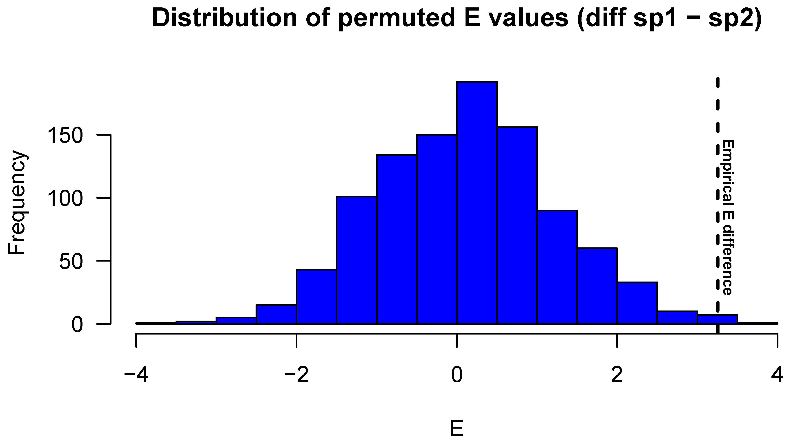

<!-- README.md is generated from README.Rmd. Please edit that file -->

# ectotemp

[](https://travis-ci.com/wouterbeukema/ectotemp)
[](https://cran.r-project.org/package=ectotemp)

## Easy and rapid quantitative estimation of small terrestrial ectotherm temperature regulation effectiveness in R.

ectotemp consists of a modest function library that can be used to
evaluate temperature regulation effectivenes in small terrestrial
ectotherms, once data describing field-active body temperatures
(*T*<sub>b</sub>), environmental (operative) temperatures
(*T*<sub>e</sub>) and preferred temperatures (the set-point range,
*T*<sub>set</sub>) have been collected. To this aim, ectotemp builds on
classical work by Hertz et al. (1993, and references therein), Christian
and Weavers (1996), and Blouin-Demers and Weatherhead (2001). Options
for bootstrapping and permutation testing are included to test
hypotheses about divergence between organisms, species or populations.
Users of this package do not need to be particularly experienced in R,
but are expected to be familiar with the background, appropriate choice,
and caveats of the available functions (Hertz et al. 1993, Christian and
Weavers 1996, Wills and Beaupre 2000, Blouin-Demers and Nadeau 2005).

Ectotemp provides functions for the following types of analyses:

  - The **thermal quality of the habitat (*d*<sub>e</sub>)** and
    associated descriptive statistics, which estimate the degree to
    which environmental temperature matches the set-point range;

  - The **accuracy of temperature regulation (*d*<sub>b</sub>)** and
    associated descriptive statistics, which estimate the degree to
    which ectotherms experience body temperature outside of their
    set-point range;

  - Choice between several approaches to **calculate effectiveness of
    temperature regulation (*E*)**, including bootstrap resampling of
    the original distributions of *T*<sub>b</sub> and *T*<sub>e</sub> to
    determine confidence interval for the mean, and permutation tests
    for between-population or species comparisons;

  - **Exploitation of the thermal environment (Ex)**; the amount of time
    when field body temperatures (*T*<sub>b</sub>) are within the
    set-point range, relative to the total amount of time during which
    this could have been possible as indicated by operative temperatures
    (*T*<sub>e</sub>).

## Installation

The released version of ectotemp can be installed from CRAN with:

``` r
install.packages("ectotemp")
```

Or the latest, development version from GitHub with:

``` r
library(devtools)
install_github("wouterbeukema/ectotemp")
```

## Examples

**Analyse**<br/> Output summary of `bootstrap_E`, which combines
operative and body temperature data (*T*<sub>e</sub>, *T*<sub>b</sub>)
and the bounds of the set-point range (predetermined values, 19.35°C and
26.44°C in the example below) with the desired method to estimate
thermoregulation effectiveness (*E*; either ‘hertz’ or ‘blouin’), and
the number of bootstrap samples drawn with replacement (10.000 in the
example below). The output consists of the mean, its 95% confidence
interval, and the full list of obtained *E* values.

``` r

>E_bootstrapped <- bootstrap_E(te, tb, 14.44, 18.33, 'blouin', 10000)
>head(E_bootstrapped$'Confidence Interval')
$`mean`
[1] 2.930867
$lower
[1] 2.918643
$upper
[1] 2.943091
```

**Compare**<br/> Permutation testing to compare the effectiveness of
thermoregulation (*E*) between populations or species. The function
`compare_E` relies on similar input information as in the above example.
First, an empirical value that describes the actual difference in *E*
between two entities is calculated, which is subsequently compared to a
null distribution obtained through sampling without replacement from the
pooled *T*<sub>e</sub> and *T*<sub>b</sub> values of both entities. The
output includes permutation test results and a graphical overview of the
empirical difference in *E* along with the permuted null distribution.

``` r

>E_diff <- compare_E(datasp1, datasp2,
                  19.35, 26.44, 
                  14.44, 18.33,
                  'blouin',
                  10000)
>E_diff
$`Empirical difference in E`
[1] 3.256671

$`p value`
[1] 0.001
```



## References

Blouin-Demers, G., & Weatherhead, P. J. (2001). Thermal ecology of black
rat snakes (*Elaphe obsoleta*) in a thermally challenging environment.
Ecology, 82(11), 3025-3043.<br/> Blouin-Demers, G., & Nadeau, P. (2005).
The cost-benefit model of thermoregulation does not predict lizard
thermoregulatory behavior. Ecology, 86(3), 560-566.<br/> Christian, K.
A., & Weavers, B. W. (1996). Thermoregulation of monitor lizards in
Australia: an evaluation of methods in thermal biology. Ecological
monographs, 66(2), 139-157.<br/> Hertz, P. E., Huey, R. B., & Stevenson,
R. D. (1993). Evaluating temperature regulation by field-active
ectotherms: the fallacy of the inappropriate question. The American
Naturalist, 142(5), 796-818.<br/> Wills, C. A., & Beaupre, S. J. (2000).
An application of randomization for detecting evidence of
thermoregulation in timber rattlesnakes (*Crotalus horridus*) from
northwest Arkansas. Physiological and Biochemical Zoology, 73(3),
325-334.
