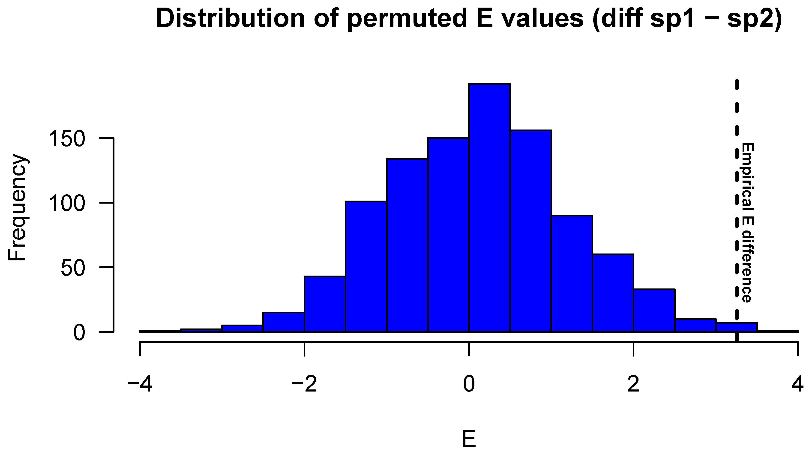

# Summary
Environmental change research regularly makes use of indices that translate natural complexity into measurable elements. Such indicators describe the state and changes in natural systems, communities, or organisms. For instance, climate change indices may be used to compare weather conditions between different regions, whereas diversity indices summarize measures of local or regional species richness and abundance. At organismal level, a suite of different indices exist to describe physiology, behaviour, and vulnerability of the entity in question. 

In what would become a seminal paper, @hhs93 introduced several quantitative indices specifically aimed at evaluating temperature regulation effectiveness of small, terrestrial ectotherms such as reptiles or insects. Ectotherms, informally known as ‘cold-blooded animals’, are popular models in environmental and evolutionary research because their activity and performance are subject to the surrounding thermal landscape. Most ectotherms are nevertheless able to regulate their body temperature by using physiological and behavioural mechanisms, of which basking in lizards constitutes a well-known example. Research during the past decades has demonstrated that the extent and effectiveness of such thermoregulation may, among other examples, determine organism susceptibility to climate change, disease, and slow or promote selection [e.g. @hs76; @hhs03; @a90; @ksp09; @hkkhjw12]. The methods introduced by @hhs93 are consequently often applied in ecological and evolutionary studies, amounting to well over 700 citations as of mid-2020.

Implementing the research protocol of @hhs93 is however hampered by the succession of formulae that are not readily applied in standard statistical software, and due to lack of a platform to run and compare often-used alternatives or updates presented by subsequent authors [e.g. @cw96; @bw01; @ss04; see also @gac19]. In an attempt to facilitate easy, rapid and consistent quantitative estimation of small ectotherm thermoregulation effectiveness I therefore designed the R package `ectotemp`, which builds on work by @hhs93, @cw96 and @bw01. The `ectotemp` package is a modest function library as well as an analytical framework written in the open-source R language (R Core Team 2018), and is freely available from CRAN and GitHub (see details below). Users of `ectotemp` do not need to be particularly experienced in R, but are expected to be familiar with the background, appropriate choice, and caveats of the available functions [e.g. @bn05]. Recent variants to some of the available indices that compress environmental temperature data into central or extreme tendencies [e.g. @dthsghm08; @hdtvhag09] are at this point not included in `ectotemp`.

# Aim of the package
The aim of the `ectotemp` package is to facilitate easy and rapid estimation of small, terrestrial ectotherm thermoregulation effectiveness after data describing field-active body temperatures (*T*b), environmental (operative) temperatures (*T*e) and preferred temperatures (the set-point range, *T*set) have been collected. The package provides functions for the following types of analyses:
- The accuracy of temperature regulation (*d*b) and associated descriptive statistics, which estimate the degree to which ectotherms experience body temperature outside of their set-point range;
- Thermal habitat quality (*d*e) and associated descriptive statistics, which estimate the degree to which environmental temperatures match the set-point range;
- Choice between several approaches to calculate thermoregulation effectiveness (*E*), including bootstrap resampling of the original distributions of *T*b and *T*e to determine confidence interval for the mean. I here introduce the use of permutation tests for between-population or species comparisons;
- Exploitation of the thermal environment (Ex); the amount of time when *T*b are within the set-point range, relative to the total amount of time during which this could have been possible as indicated by environmental temperatures.

The released version of `ectotemp` can be installed from CRAN with:
``` r
install.packages("ectotemp")
```

Or the latest, development version from GitHub with:
``` r
library(devtools)
install_github("wouterbeukema/ectotemp")
 ```

# Examples
*Example 1:* Output summary of `bootstrap_E`, which combines environmental and body temperature data (*T*e and *T*b) and the bounds of the set-point range (predetermined values, 19.35°C and 26.44°C in the example below) with the desired method to estimate thermoregulation effectiveness (*E*; either ‘hertz’ or ‘blouin’), and the number of bootstrap samples drawn with replacement (10.000 in the example below). The output consists of the mean, its 95% confidence interval, and the full list of obtained *E* values.

``` r
>E_bootstrapped <- bootstrap_E(te, tb, 14.44, 18.33, 'blouin', 10000)
>head(E_bootstrapped$'Confidence Interval')
$`mean`
[1] 2.930867
$lower
[1] 2.918643
$upper
[1] 2.943091
```

*Example 2:* Permutation testing to compare thermoregulation effectiveness (*E*) between populations or species. The function `compare_E` relies on similar input information as in the above example. First, an empirical value that describes the actual difference in *E* between two entities is calculated, which is subsequently compared to a null distribution obtained through sampling without replacement from the pooled *T*e and *T*b values of both entities. The output includes permutation test results and a graphical overview (see \autoref{Figure 1}) of the empirical difference in *E* along with the permuted null distribution.

``` r
>E_diff <- compare_E(datasp1, datasp2,
                  19.35, 26.44, 
                  14.44, 18.33,
                  'blouin',
                  10000)
>E_diff
$`Empirical difference in E`
[1] 3.256671

$`p value`
[1] 0.001
```



# Acknowledgements
This work was funded by PhD fellowship 11ZK916N-11ZK918N awarded to Wouter Beukema by the Research Foundation - Flanders (FWO).

# References